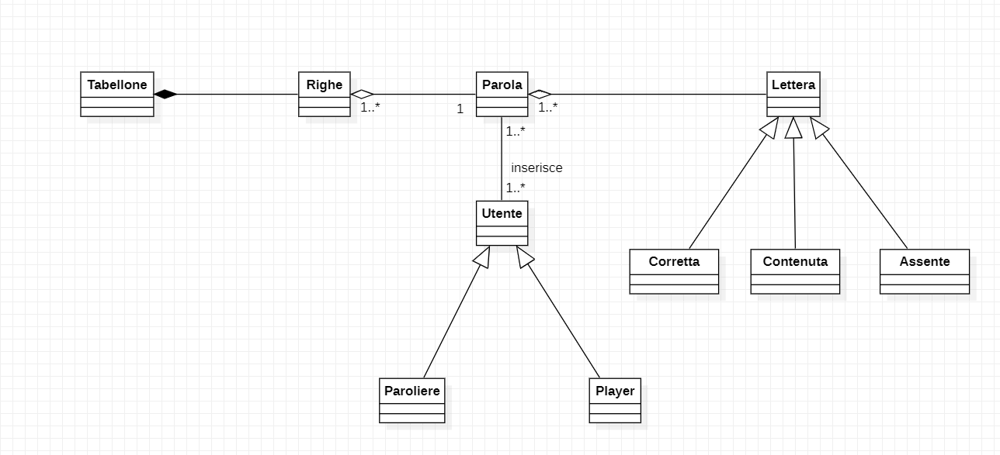

# **Relazione tecnica**

## Indice

---
[1. Introduzione del progetto](#introduzione-del-progetto)

[2. Modello di dominio](#modello-di-dominio)

[3. Requisiti specifici](#requisiti-specifici)

- [3.1 Requisiti funzionali](#requisiti-funzionali)
- [3.2 Requisiti non funzionali](#requisiti-non-funzionali)

[4. OO Design](#oo-design)
- [4.1 Diagrammi delle classi](#diagrammi-delle-classi)
- [4.2 Diagrammi di sequenza](#diagrammi-di-sequenza)

---

## **Introduzione del progetto**

---

>Il seguente progetto si basa sulla realizzazione del gioco Wordle a riga di comando.
Il gioco si basa sul cercare di indovinare una parola composta da 5 lettere effettuando un massimo di 6 tentativi.
La parola da indovinare viene decisa dal paroliere, prima che il gioco inizi.

>L’utente, dunque, quando inserirà una parola, avrà un riscontro positivo o negativo in base alla correttezza della parola. Questo riscontro consiste nel colorare di verde la singola lettera se essa è presente nella posizione giusta della parola, di giallo se la singola lettera è presente nella parola ma inserita nella posizione errata oppure non colorarla se è errata, cioè se non è presente nella parola da indovinare.

---

## **Modello di dominio**

---
Di seguito è presentato il modello di dominio del progetto.

---

# Requisiti specifici
## Requisiti funzionali

---
È stata abbozzata la relazione tecnica:
>- Formato: Markdown
>- Dove: nel repository _/docs/_
>- Nome file: Report.md
>- Sezioni:
>   - 1.0. Introduzione;
>   - 2.0. Modello di dominio;
>   - 3.0. Requisiti specifici;
>       - 3.1. Requisiti funzionali;
>       - 3.2. Requisiti non funzionali;
>   - 4.0. OO Design (diagrammi delle classi e diagrammi di sequenza delle user story più importanti con eventuali commenti alle decisioni prese);

---

Criteri che devono essere soddisfatti per qualsiasi user story:
>- C'è un'issue con label «user story»;
>- La issue è in un Milestone e in una Project Board;
>- Assegnazione a uno o al più due componenti del team;
>- Ogni classe è preceduta da un commento che riassume la responsabilità della classe; 
>- Ogni classe è preceduta da un commento per indicare se è di tipo &lt;&lt;Entity&gt;&gt;, &lt;&lt;Control&gt;&gt;, &lt;&lt;Boundary&gt;&gt;, &lt;&lt;noECB&gt;&gt;;
>- i commenti iniziano con /** e terminano con with */;
>- I commit devono avere una descrizione breve ma significativa;
>- C'è una Pull Request (PR) che corrisponde alla user story;
>- La PR è in un Milestone ma non in una Project Board;
>- C'è un commento che linka la PR all'issue (es. "closes #22");
>- La PR è accettata a review avvenuto ed esplicito;
>- Build costruito con successo;
>- Docker image caricata con successo;
>- L'esecuzione rispetta i criteri di accettazione;

---

Le seguenti user story inizierebbero con *Come paroliere voglio*...
1. Impostare una parola segreta manualmente: Al comando `/nuova <parola>` l’applicazione risponde:
    - Parola segreta troppo corta se i caratteri sono inferiori a quelli del gioco;
    - Parola segreta troppo lunga se i caratteri sono superiori a quelli del gioco;
    - Parola segreta non valida se ci sono caratteri che non corrispondono a lettere dell’alfabeto;

&emsp;&emsp;Altrimenti l’applicazione risponde con OK e memorizza la parola fino a chiusura applicazione.
È possibile cambiare la parola durante una sessione di gioco anche senza uscire dall’applicazione;

2. Mostrare la parola segreta: Al comando `/mostra` l’applicazione risponde visualizzando la parola segreta;

---

