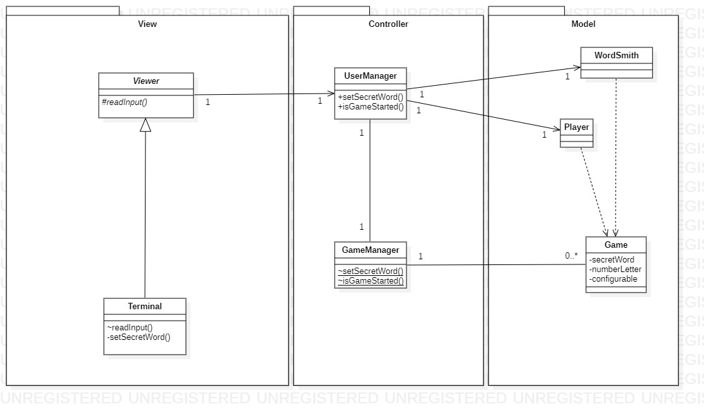
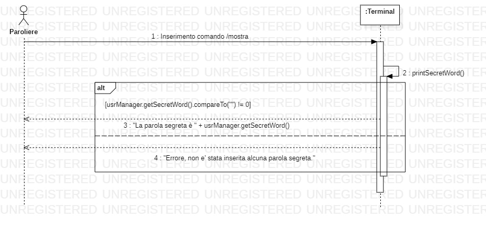
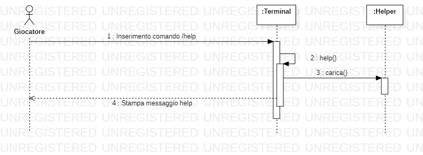
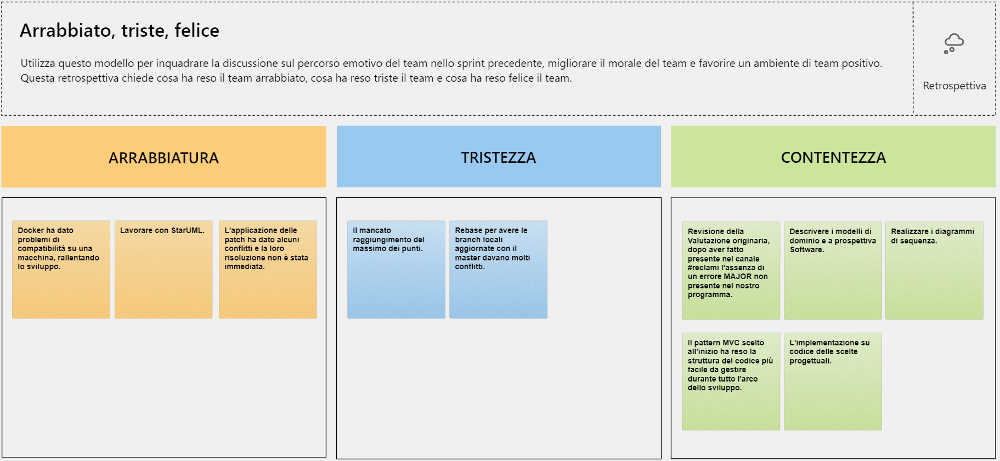

# **Relazione tecnica**

## Indice

---
[1. Introduzione del progetto](#1-introduzione-del-progetto)

[2. Modello di dominio](#2-modello-di-dominio)

[3. Requisiti specifici](#3-requisiti-specifici)

- [3.1 Requisiti funzionali](#31-requisiti-funzionali)
- [3.2 Requisiti non funzionali](#32-requisiti-non-funzionali)

[4. System Design](#4-system-design)
- [4.1 Stile architetturale adottato](#41-stile-architetturale-adottato)

[5. OO Design](#5-oo-design)
- [5.1 Diagrammi delle classi](#51-diagrammi-delle-classi)
- [5.2 Diagrammi di sequenza](#52-diagrammi-di-sequenza)

[6. Riepilogo test](#6-riepilogo-test)

[7. Manuale Utente](#7-manuale-utente)

[9. Analisi Retrospettiva](#9-analisi-retrospettiva)

---

# **1. Introduzione del progetto**

>Il seguente progetto si basa sulla realizzazione del gioco Wordle a riga di comando.
Il gioco si basa sul cercare di indovinare una parola composta da 5 lettere effettuando un massimo di 6 tentativi.
La parola da indovinare viene decisa dal paroliere, prima che il gioco inizi.

>L’utente, dunque, quando inserirà una parola, avrà un riscontro positivo o negativo in base alla correttezza della parola. Questo riscontro consiste nel colorare di verde la singola lettera se essa è presente nella posizione giusta della parola, di giallo se la singola lettera è presente nella parola ma inserita nella posizione errata oppure non colorarla se è errata, cioè se non è presente nella parola da indovinare.

---

# **2. Modello di dominio**

Di seguito è presentato il modello di dominio del progetto.

---

# **3. Requisiti specifici**
## 3.1 Requisiti funzionali

---
È stata abbozzata la relazione tecnica:
>- Formato: Markdown
>- Dove: nel repository _/docs/_
>- Nome file: Report.md
>- Sezioni:
>   - 1.0. Introduzione;
>   - 2.0. Modello di dominio;
>   - 3.0. Requisiti specifici;
>       - 3.1. Requisiti funzionali;
>       - 3.2. Requisiti non funzionali;
>   - 5.0. OO Design (diagrammi delle classi e diagrammi di sequenza delle user story più importanti con eventuali commenti alle decisioni prese);

---

Criteri che devono essere soddisfatti per qualsiasi user story:
>- C'è un'issue con label «user story»;
>- La issue è in un Milestone e in una Project Board;
>- Assegnazione a uno o al più due componenti del team;
>- Ogni classe è preceduta da un commento che riassume la responsabilità della classe; 
>- Ogni classe è preceduta da un commento per indicare se è di tipo &lt;&lt;Entity&gt;&gt;, &lt;&lt;Control&gt;&gt;, &lt;&lt;Boundary&gt;&gt;, &lt;&lt;noECB&gt;&gt;;
>- i commenti iniziano con /** e terminano con with */;
>- I commit devono avere una descrizione breve ma significativa;
>- C'è una Pull Request (PR) che corrisponde alla user story;
>- La PR è in un Milestone ma non in una Project Board;
>- C'è un commento che linka la PR all'issue (es. "closes #22");
>- La PR è accettata a review avvenuto ed esplicito;
>- Build costruito con successo;
>- Docker image caricata con successo;
>- L'esecuzione rispetta i criteri di accettazione;

---

Le seguenti user story inizierebbero con *Come paroliere voglio*...
1. Impostare una parola segreta manualmente: Al comando `/nuova <parola>` l’applicazione risponde:
    - Parola segreta troppo corta se i caratteri sono inferiori a quelli del gioco;
    - Parola segreta troppo lunga se i caratteri sono superiori a quelli del gioco;
    - Parola segreta non valida se ci sono caratteri che non corrispondono a lettere dell’alfabeto;
    - Altrimenti l’applicazione risponde con OK e memorizza la parola fino a chiusura applicazione.
È possibile cambiare la parola durante una sessione di gioco anche senza uscire dall’applicazione;

2. Mostrare la parola segreta: Al comando `/mostra` l’applicazione risponde visualizzando la parola segreta;

---

Le seguenti user story inizierebbero con *Come giocatore voglio*...
1. Mostrare l'help con elenco comandi e regole del gioco: Al comando `/help` o invocando l'app con flag `--help` o `-h` il risultato è una descrizione concisa, che normalmente appare all'avvio del programma, seguita dalla lista di comandi disponibili, uno per riga, come da esempio successivo:
    - `gioca`;
    - `esci`;
    - ...

2. Iniziare una nuova partita: Al comando `/gioca` se nessuna partita è in corso l'app mostra la matrice dei tentativi vuota, ma senza mostrare la tastiera, e si predispone a ricevere il primo tentativo o altri comandi.

3. Abbandonare una partita: Al comando `/abbandona` l'app chiede conferma.
    - Se la conferma è positiva, l'app comunica l’abbandono;
    - Se la conferma è negativa, l'app si predispone a ricevere un altro tentativo o altri comandi;

4. Chiudere il gioco: Al comando `/esci` l'applicazione chiede conferma.
    - Se la conferma è positiva, l'app si chiude restituendo un __zero exit code__;
    - Se la conferma è negativa, l'app si predispone a ricevere nuovi tentativi o comandi;

5. Effettuare un **tentativo** per indovinare la parola segreta. Digitando caratteri sulla tastiera e inviando l’applicazione risponde:
    - Tentativo incompleto se i caratteri sono inferiori a quelli della parola segreta;
    - Tentativo eccessivo se i caratteri sono superiori a quelli della parola segreta;
    - Tentativo non valido se ci sono caratteri che non corrispondono a lettere dell’alfabeto;
    - Altrimenti riempiendo la prima riga libera della matrice dei tentativi con i caratteri inseriti e colorando lo sfondo di verde se la lettera è nella parola segreta e nel posto giusto, di giallo se la lettera è nella parola segreta ma nel posto sbagliato e di grigio se la lettera non è nella parola segreta;

    - Se le lettere sono tutte verdi l’applicazione risponde:
        - `Parola segreta indovinata - Numero tentativi: <…>`; E si predispone a nuovi comandi;
    - Se il tentativo fallito è l’ultimo possibile, l’applicazione risponde:
        - `Hai raggiunto il numero massimo di tentativi. La parola segreta è <…>`; E si predispone a nuovi comandi;

---

## 3.2 Requisiti non funzionali

---

Il container docker dell’app deve essere eseguito da terminali che supportano Unicode con encoding UTF-8 o UTF-16.
Elenco di terminali supportati:
>- **Linux**: terminal
>- **macOS**: terminal
>- **Windows**: Powershell - Gitbash (in quest'ultimo caso il comando Docker ha come prefisso winpty; es: winpty docker -it ...)

### Comando per l’esecuzione del container
Dopo aver eseguito il comando `docker pull` copiandolo da GitHub Packages, il comando Docker da usare per eseguire il container contenente l’applicazione è:

>`docker run --rm -it ghcr.io/softeng2122-inf-uniba/wordle-hellman:latest`

---

# **4. System Design**
## 4.1 Stile architetturale adottato

---
Come pattern architetturale è stato utilizzato l'__MVC__. Si è fatta questa scelta in quanto è il pattern che meglio riusciva ad isolare il ruolo di ciascuna classe e per dare un'organizzazione e struttura chiara all'intero codice del progetto.

La sigla __MVC__ sta per __Model View Controller__ ove __Model__ fornisce i metodi per accedere ai dati utili all'applicazione, __View__ visualizza i dati contenuti nel model e si occupa dell'interazione con utenti e agenti, __Controller__ riceve i comandi dell'utente e li attua modificando lo stato degli altri due componenti.

Come __Model__ sono state scelte le classi __WordSmith__, __Player__, __Game__ e __Word__.

Come __View__ sono state scelte le classi __Viewer__, __Terminal__ e __Parser__.

Come __Controller__ sono state scelte le classi __UserManager__ e __GameManager__.

---

# **5. OO Design**
## 5.1 Diagrammi delle classi

---
Di seguito è presentato il modello a prospettiva software generale del progetto.

Di seguito sono presentate i modelli a prospettiva software dei comandi del gioco:

### Impostare una parola segreta manualmente

### Mostrare parola segreta

### Help

### Gioca

### Abbandona

### Chiusura gioco

### Effettuare tentativo parola segreta

## 5.2 Diagrammi di Sequenza

---
Di seguito sono presentati i diagrammi di sequenza del progetto.
Per la lettura dell'input dell'utente e il riconoscimento dei comandi si utilizza il parser prima dell'esecuzione delle funzionalità richieste del gioco.

### Parser

### Come paroliere voglio impostare una parola segreta manualmente

### Come paroliere voglio mostrare la parola segreta

### Come giocatore voglio mostrare l'help con elenco comandi

### Come giocatore voglio iniziare una nuova partita

### Come giocatore voglio abbandonare la partita

### Come giocatore voglio chiudere il gioco

### Come giocatore voglio effettuare un tentativo per indovinare la parola segreta

---

# **6. Riepilogo test**

*Casi di test* totali:

Di seguito il report di *jacoco*:

---

# **7. Manuale utente**

Per poter avviare l'applicazione è necessario utilizzare docker.

Il container docker dell’app deve essere eseguito da terminali che supportano Unicode con encoding UTF-8 o UTF-16.

### Comando per l’esecuzione del container
Dopo aver eseguito il comando `docker pull` copiandolo da GitHub Packages, il comando Docker da usare per eseguire il container contenente l’applicazione è:

>`docker run --rm -it ghcr.io/softeng2122-inf-uniba/wordle-hellman:latest`

Wordle è un videogioco in cui il giocatore deve indovinare una parola di cinque lettere in meno di sei tentativi.

I comandi del paroliere per interagire con il gioco sono: 
   >- imposta parola segreta (comando /nuova)
   >- mostra parola segreta (comando /mostra) 
 
I comandi del giocatore per interagire con il gioco sono:
   >- inizia una nuova partita (comando /gioca)
   >- abbandona la partita corrente (comando /abbandona)
   >- chiudere il gioco (comando /esci)
   >- effettua un tentativo per indovinare la parola segreta (inserendo qualsiasi input dopo /gioca)

---

# **9. Analisi Retrospettiva**
Di seguito è riportata lo screenshot relativo analisi retrospettiva

